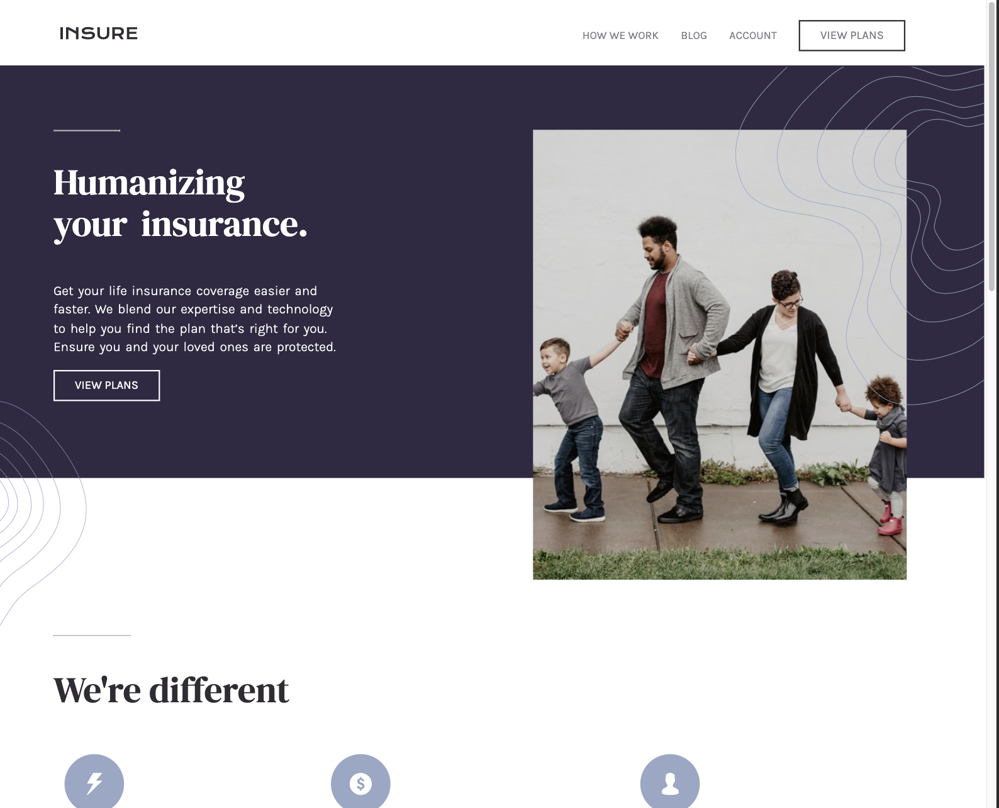

# Insurance landing page
This project is a landing page, built with HTML, CSS, and JavaScript.
It's a solution to the [Insure landing page challenge on Frontend Mentor](https://www.frontendmentor.io/challenges/insure-landing-page-uTU68JV8). Frontend Mentor challenges help you improve your coding skills by building realistic projects. 

## Live project



See the project live: [https://insurance-fm-landingpage.netlify.app/#](https://insurance-fm-landingpage.netlify.app/#)


## Workflow

I'm currently working on the code and the design, with a mobile first approach:

- The mobile design has been entirely made: the interactive hamburger menu will be added at the end, as a JavaScript separated task.

- Desktop design is being completed, through media queries applied to mobile design.

- The tablet design still needs to be designed (since it didn't come with the starter kit) and coded. This will be an opportunity to learn the basics of web design and adapt a mobile layout into a tablet one.


## Important CSS

- Flexbox layout model. It helped me to give a proper orientation and order to the body and the sections in the mobile design. Additionally, I have found this layout to be a good starter point to obtain responsiveness.

How I styled the hero-section for smartphones:

```css
#hero-section {
  display: flex;
  flex-direction: column;
  align-items: center;
  justify-content: center;
}
```

- 'Position: relative; z-index: 2'. I used the position-relative property to create a multi-layered layout, where certain elements needed to be visually layered on top of others.

example:

```css
.hero-bottom-pattern {
    
    position: relative;
    z-index: 2;
    
    width: 26%;
    height: auto;

    margin-left: 75%;
    margin-top: -90px;

}
```

- I'll keep updating this README.md along with the code.
